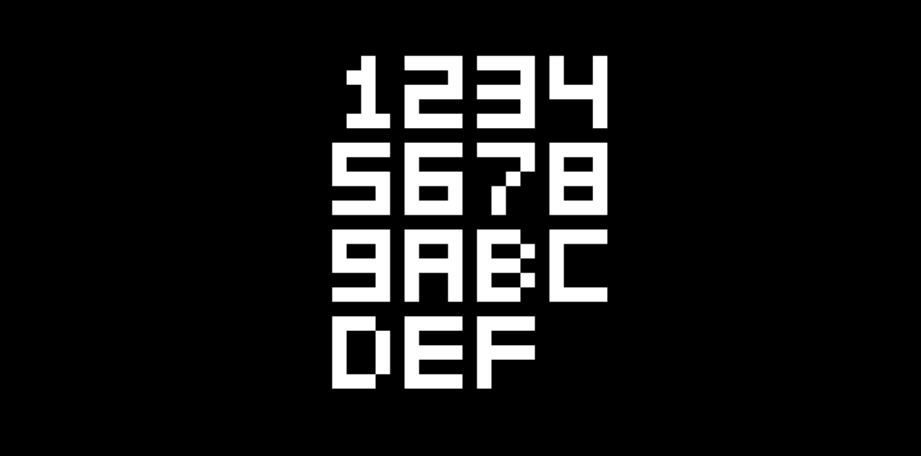
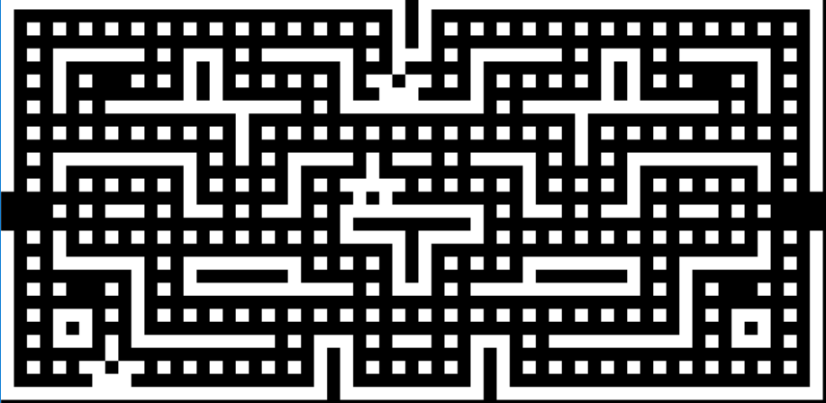
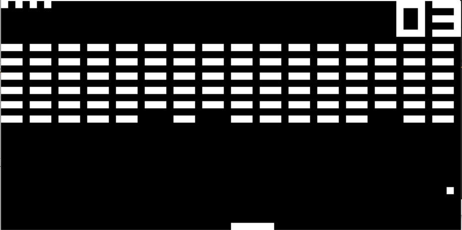
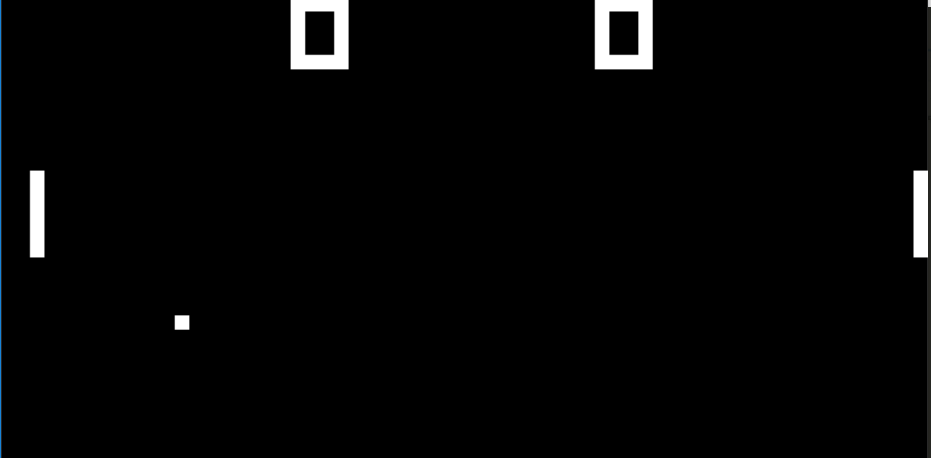

# Chip8-Emulator

Use `nimble build` to build.

## Key Bindings

| Original | Emulator |
|----------|----------|
| 1 2 3 C  | 1 2 3 4  |
| 4 5 6 D  | Q W E R  |
| 7 8 9 E  | A S D F  |
| A 0 B F  | Z X C V  |

## Screenshots

